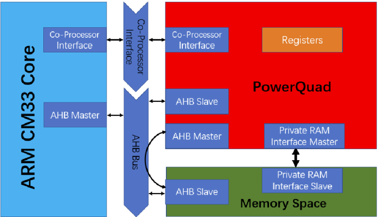
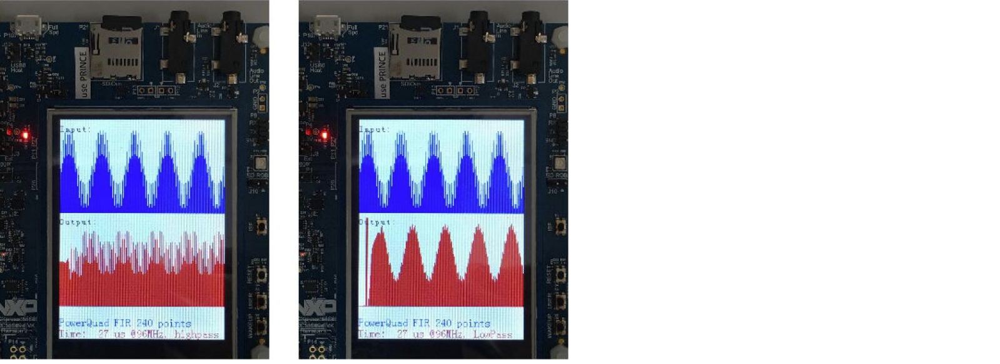
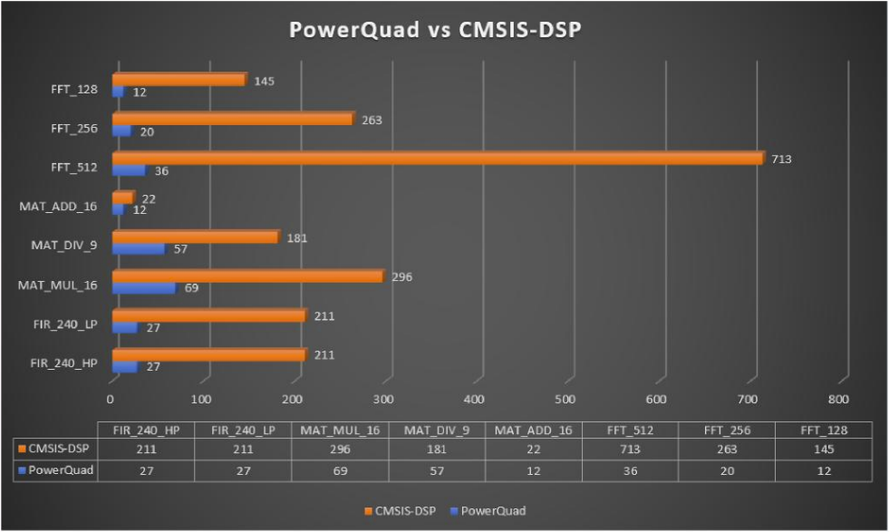

# NXP Application Code Hub

## AN13498: Digital Signal Processing for NXP LPC553x/LPC55S3x Using PowerQuad
Please refer to AN13498 for complete instructions on how to use this software.
https://www.nxp.com/docs/en/application-note/AN13498.pdf

PowerQuad is integrated with the Arm Cortex-M33 co-processor Interface. It can be accessed through the co-processor instructions (MCR and MRC). Also, there are programmable registers designed inside the PowerQuad to connect the AHB bus. User code running on the Cortex-M33 core can read and write its register, as other normal programmable modules. See Figure 1. However, specific access ways are for the specific usage. Generally, for PowerQuad, Arm Cortex-M co-processor interface, and AHB slave interface are used to deliver the commands/configurations. AHB master interface and the private RAM master interface are used to operate the memory.

#### Boards: LPCXpresso55S36
#### Categories: Industrial
#### Peripherals: UART, GPIO, FLASH
#### Toolchains: IAR

## Table of Contents
1. [Software](#step1)
2. [Hardware](#step2)
3. [Setup](#step3)
4. [Results](#step4)
5. [FAQs](#step5) 
6. [Support](#step6)
7. [Release Notes](#step7)

## 1. Software

The demo runs on the LPCXpresso55S36 board with an LCD screen module to show the GUI. In the demo project, a simple framework can switch the separate task as a scheduler. Execute simple tasks one by one, for FFT, matrix, and FIR. With the LCD screen module, the display function is integrated into the framework. The PowerQuad FFT, matrix, and FIR filter are chosen in this demo. These calculations are popular in most DSP application but usually cost time when implemented by pure software (Arm CMSIS-DSP Lib). PowerQuad vs Arm CMSIS-DSP performance provides a comparison of performance for PowerQuad APIs and Arm CMSIS-DSP API. This application note does not discuss the details about the calculation process. For further information, see PowerQuad UM and SDK driver code. A detailed illustration about using PowerQuad APIs is described for FFT cases. The same idea is applied to other cases.

- SDK: 2.9.2
- FatFS: R0.14b
- CM33: IAR embedded Workbench 9.30.1

## 2. Hardware

- Micro USB Cable
- LPCXpresso55S36 Rev A
- Personal Computer

## 3. Setup

Before running the DSP example, set up the hardware environment.

* Prepare an LPCXpresso55S36. 
*  Prepare an LCD module (wave-shape 2.8 inch TFT Shield) 
*  Connect LCD to LPCXpresso55S36 (J102, J132, J92, J122)
* Connect pin 3 of JP64 to D13 of J9 (As flexspi uses pin 1 and 2 of JP64, BK of LCD must jump to D13 of J9.)
* Download image bin file located at .\docs\images to flexspi flash with blhost.exe. To download, follow the steps by NOR FLASH Config, Erase and Program via blhost tool, as described in LPC553x and LPC55S3x Reference Manuals. 

## 4. Results

When running the demo project, there display pages on the LCD screen module for each demo cases.

For each demo case, the LCD screen are different. the above picture is just a example of DSP's filter test case.

In the demo project, a page is set up for the comparison between the PowerQuad and Arm CMSIS-DSP when they are running the same tasks. To make a fair comparison, when running the DSP task, to achieve the highest performance, run the Arm CMSIS-DSP code in RAM and use the dedicated RAM (the private one) for PowerQuad.

## . FAQs

## 6. Support
#### Project Metadata
<!----- Boards ----->

<!----- Categories ----->

<!----- Peripherals ----->
  

<!----- Toolchains ----->

Questions regarding the content/correctness of this example can be entered as Issues within this GitHub repository.

>**Warning**: For more general technical questions regarding NXP Microcontrollers and the difference in expected funcionality, enter your questions on the [NXP Community Forum](https://community.nxp.com/)

## 7. Release Notes
| Version | Description / Update                           | Date                        |
|:-------:|------------------------------------------------|----------------------------:|
| 1.0     | Initial release on Application Code HUb        | June 7th 2023 |

